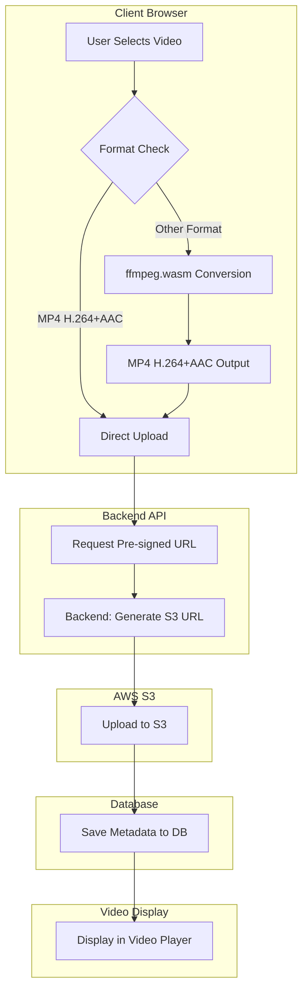

# Design Document: Video Migration to S3

## Overview

This design outlines the migration from ImageKit-based video upload and delivery to a client-side video conversion system with AWS S3 storage. The solution eliminates third-party dependencies, reduces costs, and provides better control over video processing while maintaining a seamless user experience.

The architecture consists of three main components:
1. **Client-side video conversion** using ffmpeg.wasm for browser-based transcoding
2. **Pre-signed S3 URLs** for secure, direct uploads without backend processing
3. **S3-based video delivery** replacing ImageKit URLs throughout the application

## Architecture



## Components and Interfaces

### 1. Video Converter Component

**Purpose**: Handles client-side video format detection and conversion using ffmpeg.wasm.

**Key Methods**:
```typescript
interface VideoConverter {
  detectFormat(file: File): Promise<VideoFormat>
  needsConversion(format: VideoFormat): boolean
  convertToMp4(file: File, onProgress: (progress: number) => void): Promise<Blob>
}

interface VideoFormat {
  container: string
  videoCodec: string
  audioCodec: string
  isCompatible: boolean
}
```

**Implementation Details**:
- Uses `@ffmpeg/ffmpeg` npm package (latest version with new API)
- Loads ffmpeg.wasm core (~20MB) on first use with caching
- Conversion command: `-i input -c:v libx264 -c:a aac -preset fast -crf 23 -movflags +faststart output.mp4`
- Progress tracking through ffmpeg progress events
- Error handling for unsupported formats and memory limitations

### 2. Upload Manager Component

**Purpose**: Manages the upload process using pre-signed S3 URLs with progress tracking.

**Key Methods**:
```typescript
interface UploadManager {
  requestUploadUrl(filename: string, mimeType: string): Promise<UploadUrlResponse>
  uploadToS3(file: Blob, uploadUrl: string, onProgress: (progress: number) => void): Promise<void>
  saveVideoMetadata(videoData: VideoMetadata): Promise<VideoRecord>
}

interface UploadUrlResponse {
  uploadUrl: string
  finalFileUrl: string
  expiresAt: number
}
```

**Implementation Details**:
- Uses XMLHttpRequest for upload progress tracking
- Handles pre-signed URL expiration with automatic retry
- Implements exponential backoff for failed uploads
- Validates file size limits before upload

### 3. S3 Service (Backend)

**Purpose**: Generates secure pre-signed URLs for S3 uploads and manages AWS S3 integration.

**API Endpoint**:
```typescript
POST /api/upload-url
Content-Type: application/json
Authorization: Bearer <token>

Request Body:
{
  filename: string
  mimeType: string
}

Response:
{
  uploadUrl: string
  finalFileUrl: string
  expiresAt: number
}
```

**Implementation Details**:
- Uses AWS SDK v3 for S3 operations
- Generates pre-signed URLs with 60-second expiry
- S3 path format: `videos/{userId}/{timestamp}-{filename}.mp4`
- Validates authentication before URL generation
- Sets appropriate CORS headers for browser uploads

### 4. Video Player Component

**Purpose**: Displays videos using S3 URLs with consistent playback experience.

**Key Methods**:
```typescript
interface VideoPlayer {
  loadVideo(s3Url: string): void
  generateThumbnail(s3Url: string): Promise<string>
  handlePlaybackError(error: Error): void
}
```

**Implementation Details**:
- Replaces ImageKit URL handling with S3 URL processing
- Implements thumbnail generation using canvas API for video frames
- Maintains existing UI/UX for video playback
- Handles S3 access errors gracefully

## Data Models

### Updated Video Schema

```typescript
interface VideoRecord {
  id: string
  userId: string
  title?: string
  description?: string
  url: string              // S3 URL instead of ImageKit URL
  thumbnailUrl?: string    // S3 thumbnail URL or generated data URL
  fileName: string
  fileSize?: number
  duration?: number
  createdAt: Date
  updatedAt: Date
  // Removed: fileId (ImageKit specific)
}
```

### Database Migration

**Migration Steps**:
1. Add new columns for S3 URLs while keeping ImageKit fields
2. Update application to write to both old and new fields during transition
3. Migrate existing ImageKit URLs to S3 (if needed)
4. Remove ImageKit-specific fields after migration completion

## Correctness Properties

*A property is a characteristic or behavior that should hold true across all valid executions of a system—essentially, a formal statement about what the system should do. Properties serve as the bridge between human-readable specifications and machine-verifiable correctness guarantees.*

### Property 1: Video Format Detection and Conversion Logic
*For any* video file, the system should correctly detect its format and codec information, and if the file is not MP4 with H.264+AAC, convert it to that format, otherwise upload directly without conversion.
**Validates: Requirements 1.1, 1.2, 1.3**

### Property 2: Video Conversion Quality Standards
*For any* video converted by the system, the output should be MP4 format with H.264 video codec, AAC audio codec, and mobile-optimized settings (appropriate bitrate and resolution).
**Validates: Requirements 1.4**

### Property 3: Progress Tracking Accuracy
*For any* conversion or upload operation, progress events should be emitted with values between 0 and 100, and progress should be monotonically increasing until completion.
**Validates: Requirements 1.5, 3.1**

### Property 4: S3 Pre-signed URL Generation
*For any* authenticated upload request, the S3 service should generate a valid pre-signed URL with the correct path format `videos/{userId}/{timestamp}.mp4`, Content-Type `video/mp4`, 60-second expiry, and return both upload and final file URLs.
**Validates: Requirements 2.1, 2.3, 2.4, 2.5**

### Property 5: Authentication Validation
*For any* request to the S3 service, user authentication should be validated before processing, and invalid authentication should result in a 401 Unauthorized response.
**Validates: Requirements 2.2, 6.2**

### Property 6: Error Handling and Recovery
*For any* error condition (conversion failure, network issues, URL expiration, configuration problems), the system should provide clear error messages and appropriate recovery mechanisms (retry, cleanup, user guidance).
**Validates: Requirements 1.6, 3.3, 3.4, 3.5, 3.6, 4.5, 6.5, 6.6**

### Property 7: Upload Success Confirmation
*For any* successful upload, the system should display success confirmation and properly save video metadata to the database.
**Validates: Requirements 3.2**

### Property 8: S3 URL Handling in Video Player
*For any* S3 video URL, the video player should handle it consistently across all components, generate appropriate thumbnails, and maintain the same user experience as before migration.
**Validates: Requirements 4.1, 4.2, 4.4**

### Property 9: Database S3 URL Storage
*For any* video metadata saved to the database, S3 URLs should be stored in the `url` and `thumbnailUrl` fields, and the ImageKit-specific `fileId` field should not be used.
**Validates: Requirements 5.1, 5.2, 5.3**

### Property 10: Data Migration Compatibility
*For any* existing ImageKit data, the system should provide migration paths and maintain backward compatibility during the transition period.
**Validates: Requirements 5.4, 5.5**

### Property 11: API Request/Response Format
*For any* request to `/api/upload-url`, the endpoint should accept `filename` and `mimeType` parameters and return JSON with `uploadUrl` and `finalFileUrl` properties.
**Validates: Requirements 6.3, 6.4**

<function_calls>
<invoke name="prework">
<parameter name="featureName">video-migration-s3

## Error Handling

### Client-Side Error Scenarios

1. **ffmpeg.wasm Loading Failures**
   - Network issues preventing WebAssembly download
   - Browser compatibility issues
   - Memory constraints on low-end devices
   - **Recovery**: Fallback to server-side conversion or direct upload without conversion

2. **Video Conversion Errors**
   - Unsupported video formats
   - Corrupted video files
   - Memory exhaustion during conversion
   - **Recovery**: Clear error messages with suggested file format requirements

3. **Upload Failures**
   - Network connectivity issues
   - Pre-signed URL expiration
   - S3 service unavailability
   - File size exceeding limits
   - **Recovery**: Automatic retry with exponential backoff, new URL generation

### Backend Error Scenarios

1. **Authentication Failures**
   - Invalid or expired JWT tokens
   - Missing authentication headers
   - **Response**: 401 Unauthorized with clear error message

2. **S3 Configuration Issues**
   - Invalid AWS credentials
   - Bucket access permissions
   - Region configuration errors
   - **Response**: 500 Internal Server Error with admin-friendly error details

3. **Request Validation Errors**
   - Missing required parameters
   - Invalid file types
   - **Response**: 400 Bad Request with parameter validation details

### Error Recovery Strategies

- **Progressive Enhancement**: Core functionality works without advanced features
- **Graceful Degradation**: Fallback to simpler upload methods when conversion fails
- **User Feedback**: Clear, actionable error messages with next steps
- **Retry Logic**: Exponential backoff for transient failures
- **Monitoring**: Error tracking for production debugging

## Testing Strategy

### Dual Testing Approach

The system requires both unit testing and property-based testing for comprehensive coverage:

**Unit Tests**: Verify specific examples, edge cases, and error conditions
- Test specific video format detection scenarios
- Test API endpoint responses with known inputs
- Test UI state changes for specific user actions
- Test error handling with simulated failures

**Property-Based Tests**: Verify universal properties across all inputs
- Test format detection accuracy across randomly generated video metadata
- Test S3 URL generation correctness for various user IDs and timestamps
- Test progress tracking behavior across different file sizes and conversion scenarios
- Test error handling consistency across various failure modes

### Property-Based Testing Configuration

- **Testing Library**: Use `fast-check` for TypeScript/JavaScript property-based testing
- **Test Iterations**: Minimum 100 iterations per property test
- **Test Tagging**: Each property test must reference its design document property
- **Tag Format**: `// Feature: video-migration-s3, Property {number}: {property_text}`

### Testing Implementation Requirements

Each correctness property must be implemented by a single property-based test:

1. **Property 1 Test**: Generate random video file metadata and test format detection/conversion logic
2. **Property 2 Test**: Generate random input videos and verify output format specifications
3. **Property 3 Test**: Test progress tracking with various file sizes and network conditions
4. **Property 4 Test**: Generate random user IDs and timestamps, verify URL format and properties
5. **Property 5 Test**: Test authentication with valid/invalid tokens across all endpoints
6. **Property 6 Test**: Simulate various error conditions and verify error handling responses
7. **Property 7 Test**: Test upload completion scenarios and verify success states
8. **Property 8 Test**: Test S3 URL handling across different video player components
9. **Property 9 Test**: Test database storage with various S3 URL formats
10. **Property 10 Test**: Test migration scenarios with existing ImageKit data
11. **Property 11 Test**: Test API request/response format with various parameter combinations

### Integration Testing

- **End-to-End Flows**: Test complete video upload workflows from file selection to playback
- **Cross-Browser Testing**: Verify ffmpeg.wasm compatibility across browsers
- **Performance Testing**: Measure conversion times and memory usage
- **S3 Integration**: Test actual S3 upload functionality with test buckets

### Migration Testing

- **Data Migration**: Verify existing ImageKit URLs are properly migrated
- **Backward Compatibility**: Ensure system works during transition period
- **Rollback Testing**: Verify ability to revert changes if needed

## Implementation Notes

### Technology Stack

**Frontend Dependencies**:
- `@ffmpeg/ffmpeg`: Latest version (0.12.x) with new API
- `@ffmpeg/util`: Utility functions for ffmpeg.wasm
- Remove: `imagekit-javascript`

**Backend Dependencies**:
- `@aws-sdk/client-s3`: AWS SDK v3 for S3 operations
- `@aws-sdk/s3-request-presigner`: For generating pre-signed URLs
- Remove: ImageKit-related packages

### Performance Considerations

- **Lazy Loading**: Load ffmpeg.wasm only when needed
- **Caching**: Cache ffmpeg.wasm in browser storage
- **Memory Management**: Clean up video processing memory after conversion
- **Parallel Processing**: Use Web Workers for conversion to avoid UI blocking
- **Progressive Upload**: Stream upload progress for large files

### Security Considerations

- **Pre-signed URL Security**: Short expiration times (60 seconds)
- **File Type Validation**: Strict MIME type checking
- **Size Limits**: Enforce reasonable file size limits
- **CORS Configuration**: Proper S3 bucket CORS settings
- **Authentication**: JWT token validation for all upload requests

### Browser Compatibility

- **WebAssembly Support**: Modern browsers (Chrome 57+, Firefox 52+, Safari 11+)
- **SharedArrayBuffer**: Required for ffmpeg.wasm threading (HTTPS + proper headers)
- **File API**: For handling large video files
- **Fetch API**: For S3 uploads with progress tracking